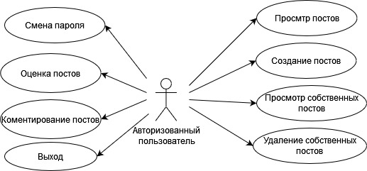
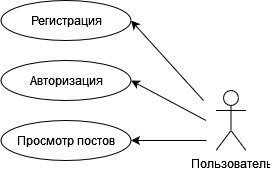
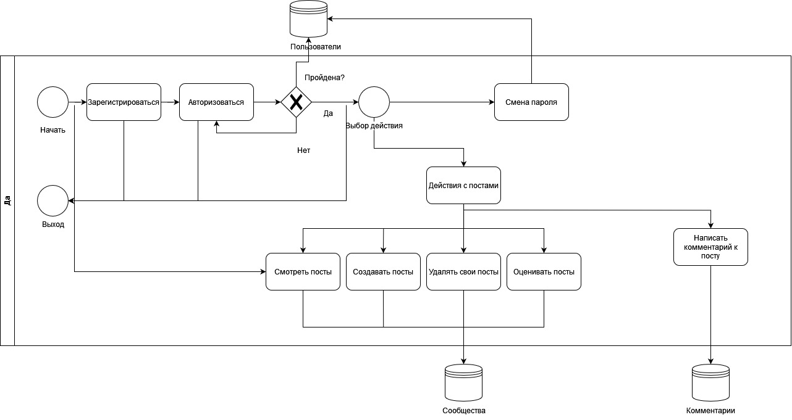
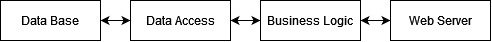

# bmstu_web

## Цель работы, решаемая проблема/предоставляемая возможность

Проект представляет собой онлайн-платформу, на которой каждый зарегистрированный пользователь может выложить фотографию предмета гардероба с ссылкой на страницу, где его можно приобрести.

Пользователи могут смотреть посты, ставить лайки и дизлайки, писать комментарии.

Таким образом данный продукт решает проблему поиска одежды, так как на нем люди смогут находить "трендовую" одежду из различных магазинов одежды.

## Краткий перечень функциональных требований

Авторизация:
- Пользователю требуется ввести свой логин и пароль для успешной авторизации;
- При неверном вводе данных пользователь должен получить соответствующее уведомление о неправильном логине или пароле;
- Авторизация должна сохраняться для последующих сеансов использования приложения.

Регистрация:
- При регистрации пользователь должен указать уникальный логин и пароль;
- При вводе уже существующего логина пользователь должен получить ошибку о том, что данный логин занят;
- Пользователь должен ввести пароль в два поля, при несовпадении паролей в полях, пользователь должен получить ошибку.

Просмотр постов:
- Пользователь должен иметь возможность просматривать все посты, созданные другими пользователями на главной странице.
- Пользователь должен иметь возможность выбирать какие вещи ему будут отображаться: для мужчин или для женщин.
- Пользователь должен иметь возможность выбирать категорию вещей, которые будут ему отображаться.
- Пользователь должен иметь возможность посмотреть количество лайков и дизлайков у поста, а также оставленные под ним комментарии.

Оценка постов:
- Авторизированный пользователь должен иметь возможность ставить лайк или дизлайк, а также оставлять комментарий под постом.

Загрузка постов:
- Авторизированный пользователь должен иметь возможность загружать свои посты.
- Авторизированный пользователь должен иметь возможность смотреть загруженные им посты.
- Авторизированный пользователь должен иметь возможность удалять загруженные им посты.

Действия профиля:
- Авторизированный пользователь должен иметь возможность сменить пароль, введя старый пароль и дважды введя новый пароль.
- Авторизированный пользователь должен иметь возможность разлогиниться.

## Use-case диаграмма системы

## BPMN диаграмма основных бизнес-процессов

## Примеры описания основных пользовательских сценариев

Пользователь:
- Регистрация
- Авторизация
- Просмотр постов

Авторизованный пользователь:
- Смена пароля
- Оценка постов
- Комментирование постов
- Выход
- Просмотр постов
- Создание постов
- Просмотр собственных постов
- Удаление собственных постов

## ER-диаграмма сущностей

## Диаграмма БД

## Компонентная диаграмма системы

## Экраны будущего web-приложения на уровне черновых эскизов

